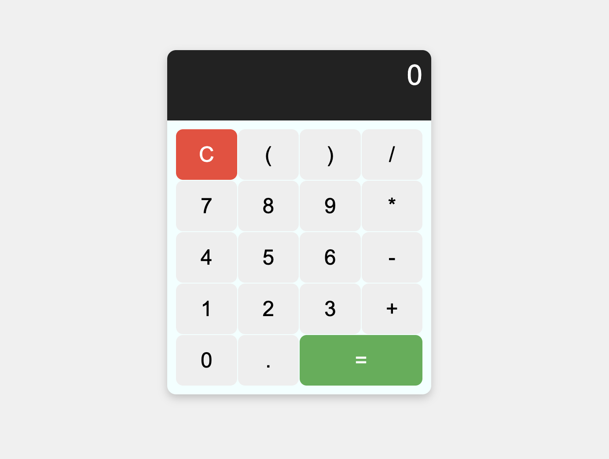

# Simple Calculator

## Description

This project is a **simple calculator** created as my first project in learning **JavaScript**. It allows basic operations like addition, subtraction, multiplication, and division.

## Features

- **Addition**: Adds two numbers.
- **Subtraction**: Subtracts one number from another.
- **Multiplication**: Multiplies two numbers.
- **Division**: Divides one number by another.
- **Simple user interface**: Uses HTML and CSS for a user-friendly interface.

## Technologies Used

- **HTML**: Page structure.
- **CSS**: Styling and interface design.
- **JavaScript**: Logic and calculations.

## Installation

1. Clone this project to your local machine:

   ```bash
   git clone https://github.com/ton-utilisateur/calculatrice-simple.git

## Screenshot

<!--  -->


